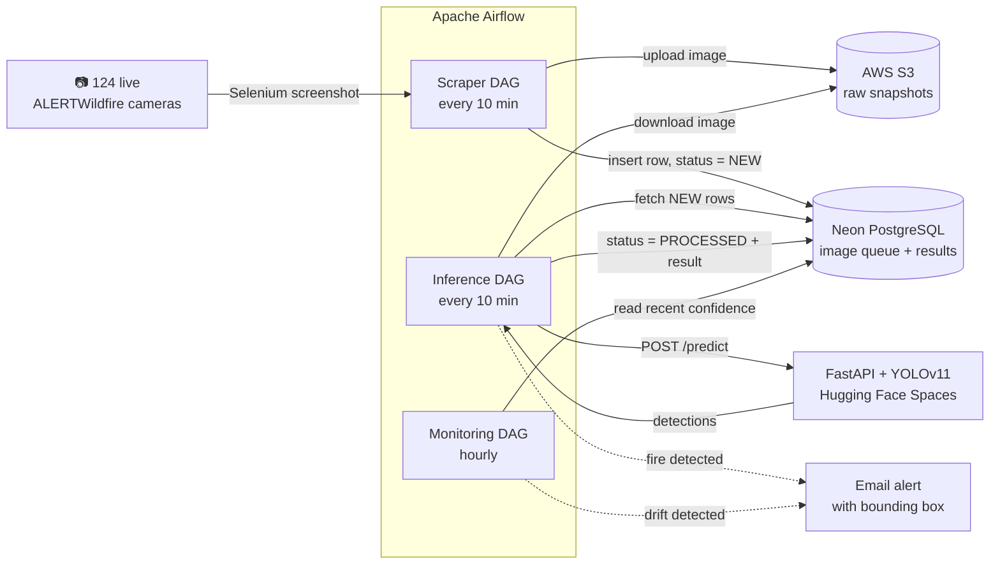

# 🔥 Wildfire Detection — Automated Monitoring of Live Fire Cameras

**An end-to-end MLOps pipeline that watches 124 live wildfire cameras, runs a fine-tuned YOLOv11 model on every snapshot, and emails an annotated alert the moment it spots fire or smoke — fully automated, 24/7.**

[    ](https://huggingface.co/spaces/Alvlt/fire-detection)
 
 
 
 
 
 
 
 
 

## The problem


[Alertwildfire.org](https://www.alertwildfire.org/) is a website that aggregates data from over a hundred forest fire surveillance cameras across the American West. Its purpose is to allow for the early detection and suppression of wildfires. The problem is that there is no automation, American citizens are expected to monitor these cameras and raise the alarm. The goal of this project is to integrate a deep learning model with these cameras so that it can detect fires as quickly as possible.


Built as a student project, but engineered to production-grade MLOps standards: automated scraping, a queue-based inference pipeline, experiment tracking, a model quality gate, drift monitoring, and CI/CD.


<sub>*Live view from the ALERTWildfire.org website.*</sub>


## Table of contents

* [Highlights](#highlights)
* [How it works](#how-it-works)
* [The pipeline, DAG by DAG](#the-pipeline-dag-by-dag)
* [Dataset](#dataset)
* [Model & training](#model--training)
* [Tech stack](#tech-stack)
* [Repository structure](#repository-structure)
* [Getting started](#getting-started)
* [Configuration](#configuration)
* [CI/CD](#cicd)
* [Results](#results)
* [Limitations & roadmap](#limitations--roadmap)
* [Credits](#credits)


## Highlights

* **124 cameras, every 10 minutes** :

  A headless Selenium scraper captures snapshots from ALERTWildfire feeds across California, Nevada, Idaho and Arizona.
* **Queue-based architecture**

  Images land in S3 and a Postgres queue (`NEW` → `PROCESSED`), so scraping and inference scale and fail independently.
* **Fine-tuned YOLOv11**

  Trained on **109,121 images** from 6 merged public datasets, intentionally balanced for night-time conditions.
* **Actionable alerts**

  On detection, an email goes out with the original frame and the predicted bounding box drawn on it.
* **Experiment tracking & quality gate**

  Every training run is logged to MLflow; a metrics gate blocks weak models from shipping.

  **Drift monitoring**: an hourly DAG watches average prediction confidence and flags when the model should be retrained.
* **CI/CD**

  GitHub Actions runs the test suite and builds the training image on every push to `main`.
* **Serverless inference**

  The model is served by a FastAPI app deployed on Hugging Face Spaces.


## How it works

The system is three independent Airflow DAGs coordinating through S3 (image storage) and a Neon PostgreSQL queue (state). Nothing talks directly to anything else, every stage reads and writes shared state, which keeps the pipeline resilient and observable.



Full architecture overview:


## The pipeline, DAG by DAG

| DAG | Schedule | What it does |
|----|----|----|
| `fire_detection_scraper` | every 10 min | Spins up headless Chrome, screenshots each of the 124 camera feeds, uploads the image to S3, and inserts a row in Postgres with status `NEW`. |
| `fire_detection_inference` | every 10 min | Pulls pending (`NEW`) images from the queue in batches, downloads them from S3, calls the FastAPI `/predict` endpoint, keeps detections above `CONFIDENCE_THRESHOLD`, writes the result back as `PROCESSED`, and emails an annotated alert on any fire. |
| `fire_detection_monitoring` | hourly | Reads the average confidence of the 100 most recent predictions; if it drifts more than 0.10 from the reference, it branches to a "retraining recommended" email alert. |

This decoupling is the point: the scraper never blocks on inference, inference is idempotent over the queue, and monitoring runs on its own clock.


## Dataset

The training set merges **6 public fire/smoke detection datasets** into a single corpus of **109,121 images** (train: 85,627 / val: 12,451 / test: 11,043).

| # | Dataset | Source | Images |
|----|----|----|----|
| 1 | Smoke-Fire-Detection-YOLO | Kaggle (sayedgamal99) | \~21,000 |
| 2 | Fire/Smoke Detection YOLO v9 | Kaggle (roscoekerby) | \~28,000 |
| 3 | fire-smoke-obstacle-dataset | Roboflow | \~26,000 |
| 4 | D-Fire *(night only)* | Kaggle (shubhamkarande13) | \~17,000 |
| 5 | FASDD — Flame And Smoke Detection *(night only)* | Public | \~6,100 |
| 6 | Smoke night dataset *(night only)* | Roboflow | \~10,000 |
|    | **Total** |    | **109,121** |

ALERTWildfire cameras run 24/7, so the corpus was deliberately balanced toward darkness: **51% of images are night scenes**, selected using brightness thresholds and CLIP-based relevance scoring. Preparation lives in `dataset/dataset_preparation.ipynb`.


## Model & training

* **Architecture:** YOLOv11-medium (`yolo11m.pt`), fine-tuned on two classes — `fire` and `smoke`.
* **Transfer learning:** the backbone is frozen (`--freeze`) and trained with the Adam optimizer.
* **Domain-aware augmentation:** rotation, scale (0.7, to handle fires both near and far), perspective, and HSV value/saturation jitter for lighting variation — but **no vertical flip**, because fire and smoke always rise upward.
* **Experiment tracking:** every run logs params, metrics, and the best weights to **MLflow**, then ships `best.pt` / `last.pt` to S3.
* **Quality gate:** `validate_metrics()` rejects any model below `mAP50 ≥ 0.30` and `recall ≥ 0.25` before it can be promoted.
* **Resumable:** `--resume` auto-loads the latest checkpoint so long training runs survive spot-instance interruptions.

```bash
# Train from scratch
python training/train.py --epochs 40 --freeze 10 --run_name V1

# Resume from the last checkpoint with a lower learning rate
python training/train.py --resume --run_name V1 --epochs 20 --freeze 5 --lr0 0.001
```


## Tech stack

| Layer | Tool |
|----|----|
| Detection model | YOLOv11 (Ultralytics), fine-tuned |
| Inference API | FastAPI on Hugging Face Spaces |
| Orchestration | Apache Airflow |
| Scraping | Selenium (headless Chrome) |
| Experiment tracking | MLflow |
| Object storage | AWS S3 |
| Database / queue | Neon PostgreSQL |
| Alerting | Gmail SMTP (annotated email) |
| Packaging | Docker / Docker Compose |
| CI/CD | GitHub Actions |


## Repository structure

```
.
├── dags/                       # Airflow DAGs (orchestration)
│   ├── scraper_dag.py          # Capture snapshots every 10 min → S3 + Postgres
│   ├── inference_dag.py        # Run detection over the queue, email alerts
│   └── monitoring_dag.py       # Hourly confidence-drift check
├── scraper/                    # Selenium scraper + Postgres data-access layer
│   ├── scraper.py
│   ├── database.py
│   └── alertwildfire_urls_list.py
├── inference_API/              # FastAPI service wrapping the YOLO model (HF Spaces)
│   └── app.py
├── training/                   # Training pipeline, quality gate, tests
│   ├── train.py
│   ├── utils.py
│   ├── MLproject
│   └── tests/
├── dataset/                    # Dataset preparation notebook
├── mlflow-server/              # MLflow tracking server (Docker)
├── docker-compose.yml          # Local Airflow + Postgres stack
├── Dockerfile.airflow
└── .github/workflows/          # CI: tests + Docker build
```


## Getting started

### Prerequisites

* Docker & Docker Compose
* An AWS account with an S3 bucket
* A PostgreSQL database (this project uses [Neon](https://neon.tech/))
* A Gmail account with an [app password](https://support.google.com/accounts/answer/185833) for alerts
* A deployed inference API (e.g. the FastAPI app in `inference_API/` on Hugging Face Spaces)

### 1. Configure your environment

Create a `.env` at the project root — see [Configuration](#configuration). **Never commit it** (it is already git-ignored).

### 2. Launch the Airflow stack

```bash
docker-compose up --build
```

Then open the Airflow UI at **http://localhost:8081** and enable the three DAGs.

### 3. (Optional) Run the inference API locally

```bash
cd inference_API
pip install -r requirements.txt
uvicorn app:app --reload      # POST an image to /predict
```


## Configuration

All services read from a single root `.env`. The variables, grouped by purpose:

```bash
# --- AWS ---
AWS_ACCESS_KEY_ID=
AWS_SECRET_ACCESS_KEY=
AWS_DEFAULT_REGION=
S3_BUCKET_NAME=          # used by the scraper + inference DAGs
S3_BUCKET=               # used by the training pipeline

# --- Database (Neon PostgreSQL) ---
DATABASE_URL=

# --- Inference API ---
INFERENCE_API_URL=       # base URL of the FastAPI /predict endpoint
CONFIDENCE_THRESHOLD=0.6 # minimum confidence to count as a detection

# --- Email alerting (Gmail SMTP) ---
ALERT_EMAIL_SENDER=
ALERT_EMAIL_PASSWORD=    # Gmail app password
ALERT_EMAIL_RECEIVER=

# --- MLflow & training ---
MLFLOW_TRACKING_URI=
DATA_YAML=               # path to the YOLO dataset config

# --- Remote training host (EC2) ---
EC2_HOST=
EC2_KEY_PATH=
EC2_KNOWN_HOSTS=
```


## CI/CD

Every push or pull request to `main` triggers the [Training Pipeline CI](.github/workflows/training.yml) workflow:


1. **Test**: installs dependencies and runs the unit suite (`pytest training/tests/test_pipeline.py`), which covers the model quality gate and the S3 upload contract.
2. **Build**: once tests pass, builds the training Docker image to guarantee the environment is reproducible.


## Results

| Metric | Value |
|----|----|
| mAP@50 | 0.607 |
| Recall | 0.557 |

Training was **stopped early to contain cloud-compute costs**. Published research on YOLO-based fire detection typically trains for \~500 epochs to reach convergence — we ran far fewer, so the model has not fully converged and recall in particular has room to grow.

That matters here because of the asymmetry of the task: **a missed fire is far more dangerous than a false alarm.** Recall is therefore the metric to optimize next, even at the cost of a few extra false positives.


## Limitations & roadmap

* **Train to convergence**: more epochs (and a learning-rate schedule) to lift recall.
* **Tune the alert threshold for recall**: accept more false positives to miss fewer fires.
* **Close the retraining loop**:  wire the drift alert to an automated retraining + redeployment trigger.
* **Distribution-aware drift detection**: replace the mean-confidence heuristic with a proper statistical test on real camera data.
* **Dashboard**: surface live detections and queue health instead of relying on email alerts alone.


## Credits

* **[ALERTWildfire](https://www.alertwildfire.org/)** — the camera network this project monitors.
* The six open datasets listed above, and their authors on Kaggle and Roboflow.
* Built as a Machine Learning Engineering project at **[Jedha Bootcamp](https://www.jedha.co/)**.

> ⚠️ This is an educational / portfolio project and is **not** an operational emergency system. Do not rely on it to detect real wildfires.


